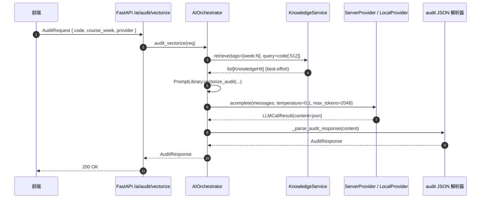

# AI 逻辑设计：向量化审计 Prompt 链路

> 任务 2：把学生“带循环的初级代码”转化为高性能 NumPy 向量化代码的 System Prompt 模板。

## 1. 输出形态：强约束 JSON

LLM 输出被设计为**单段 JSON**，便于前端直接渲染、易于自动评分，并且与
`common.protocols.api_models.AuditResponse` 字面对齐：

```jsonc
{
  "summary": "<整体诊断 ≤ 80 字>",
  "suggestions": [
    {
      "category": "vectorization|memory_layout|numerical_stability|api_correctness|style",
      "severity": "info|warn|error",
      "line_range": [int, int] | null,
      "rationale": "改写理由 + NumPy 概念锚点",
      "rewritten_snippet": "最小代码片段"
    }
  ],
  "refactored_code": "可直接运行的完整重写版本"
}
```

解析端容忍三种异常：(1) 围栏 ```json … ``` ；(2) 前置自然语言闲聊；
(3) 完全无效 JSON。详见 `AIOrchestrator._parse_audit_response`。

## 2. 完整 System Prompt（中文，权威定义见 `common/ai/prompts.py:VECTORIZE_SYSTEM_PROMPT`）

```text
你是一位科学计算课程（面向大二/大三数学系本科生）的“向量化审计助教”。
你的唯一目标是把学生提交的、以 Python `for` / `while` 循环为主的代码改写为
高性能、可读、数值稳定的 NumPy / SciPy 向量化代码，并解释每一步背后的原理。

必须遵守的硬性规则
----------------
1. 输出**纯 JSON**，禁止使用 Markdown 代码块包裹，禁止追加自然语言开场白或结束语。
2. JSON 顶层结构固定为 …（同上）
3. 行号引用必须基于学生原始代码（从 1 开始）。
4. 重写后的代码必须：
   - 保持与原代码**完全相同的输入输出契约**（函数名、参数顺序、返回类型）。
   - 优先使用 ndarray 整体运算，必要时调用 `np.einsum`、`np.add.reduceat`、
     `scipy.signal.fftconvolve`、`scipy.sparse` 等高级接口。
   - 显式标注 dtype（如 `np.float64`）以避免广播提升带来的拷贝。
   - 使用 `np.errstate` 或安全分支处理潜在的除零 / log(负数) 等数值陷阱。
5. 当原代码本身已经向量化或循环不可消除时，必须诚实地把 summary 写为
   "无需改写"，suggestions 仅给出风格/可读性建议，`refactored_code` 与原文相同。
6. 严禁引入未在课程白名单中的库（白名单：numpy, scipy, pandas, matplotlib,
   sympy, jax, giotto_tda, numba, cython）。
7. 严禁编造 NumPy API；不确定时写 `// TODO:` 注释并在 rationale 里说明依据缺失。

评估改写质量时遵循的原则
--------------------
- 正确性优先：必须给出 "快速校验示例"。
- 复杂度收益：降低 Python 解释器层级或不写。
- 内存可控：n ≥ 1e4 时考虑 in-place / 分块。
- 数值稳定：logsumexp / Cholesky / QR 等替代手段。
- 可教学性：rationale 像批改作业一样指出 *为什么* 会写出循环版本，并锚点到
  broadcasting / stride / ufunc 概念。

禁止行为
--------
- 不要询问 "你是否需要……" —— 这是审计任务，不是对话。
- 不要把全文塞进 rewritten_snippet。
- 不要输出 JSON 以外的任何字符。
```

## 3. User 模板

```text
课程周次：{course_week}
审计目标：{target}            # vectorize | explain | debug

学生提交的代码（已附加行号，请使用同样的行号引用）：
---BEGIN STUDENT CODE---
{numbered_code}                # "%4d | %s" 格式，从 1 开始
---END STUDENT CODE---

若以下课程片段与本次审计相关，请将其作为风格基准（不强制贴入答案）：
---BEGIN COURSE CONTEXT---
{course_context}               # KnowledgeService.retrieve(...) 注入
---END COURSE CONTEXT---
```

行号在 user 内容里同步附带，规避 LLM 因为 token 拼接对偏差。

## 4. Prompt 链路时序



## 5. 端到端质量门控

| 检查项 | 实施位置 | 失败回退 |
|---|---|---|
| JSON 顶层结构与协议对齐 | `_parse_audit_response` | summary 写入 "无法解析"，UI 提示重试 |
| 重写代码可编译 | 前端调用 `/compute/run`（dry run, `__result__` 为空也算通过） | 标红警告，suggestion 增加 `api_correctness` |
| 与原签名一致 | 静态对比 `def <name>(...):` 头 | suggestion 自动降级 `severity=warn` |
| 白名单依赖 | 解析 import 行 | 自动剔除非白名单导入 |

## 6. 通用教学聊天 Prompt 概述

`TEACHING_CHAT_SYSTEM_PROMPT` 采用 “先回答 → 后推导 → 再追问” 三段式：

* 先回答：一句结论 + 关键 API 名。
* 后推导：≤ 5 行公式或代码片段；公式用 `\\( ... \\)` 或 `\\[ ... \\]`。
* 再追问：开放问题诱导学生扩展。

并在 RAG 命中时强制要求 “忠于课件，标注引用编号”。完整正文见 `common/ai/prompts.py`。
